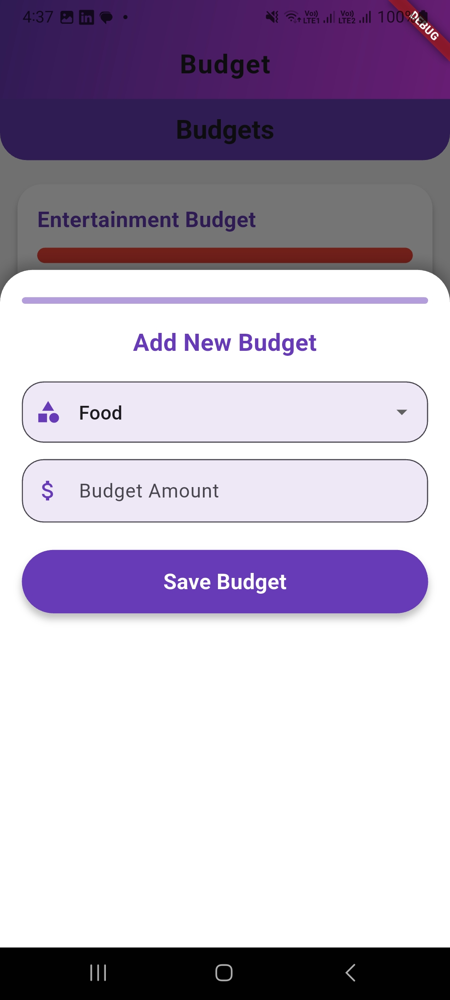

# pfm_app

A Flutter-based Personal Finance Management (PFM) app.

---

## App Overview

This app helps you manage your **expenses, income, budgets, and financial goals**.  
It provides interactive charts, dashboards, and detailed reports to track your personal finance efficiently.

---

## Screenshots

### Dashboard


### Expenses


### Income


### Goals


### Budget



### Reports


> Make sure your images are placed inside the `images` folder in your project root.  
> You can change the image paths accordingly.

---

## Getting Started

This project is a starting point for a Flutter application.

A few resources to get you started if this is your first Flutter project:

- [Lab: Write your first Flutter app](https://docs.flutter.dev/get-started/codelab)
- [Cookbook: Useful Flutter samples](https://docs.flutter.dev/cookbook)

For help getting started with Flutter development, view the
[online documentation](https://docs.flutter.dev/), which offers tutorials,
samples, guidance on mobile development, and a full API reference.

---

## Features

- Add, edit, and delete **expenses** and **income**
- Track **budgets** and get notified when exceeded
- Set and monitor **financial goals**
- Interactive **Pie Charts** and **Reports**
- Beautiful, modern **deep-purple themed UI**

---

## How to Run

1. Clone the repository:
```bash
git clone <https://github.com/chashmanrazzaq/Personal-Finance-Manager>
